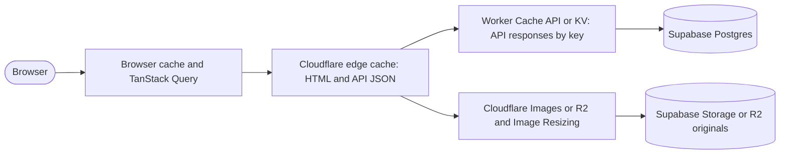

# Caching strategy

Goal: the public site should serve almost every request without touching Postgres, so the Supabase free tier (500 MB database, 1 GB storage, 5 GB egress a month at the time of writing; quotas change, so check the current limits) carries the whole catalog comfortably. Writes are rare and small.

## Layers

| Layer                | What                                                     | TTL                                                     | Invalidation                                   |
| -------------------- | -------------------------------------------------------- | ------------------------------------------------------- | ---------------------------------------------- |
| TanStack Query       | loader data reused on client navigation                  | `staleTime` 5 min (`lib/queries.ts`)                    | page reload or `queryClient.invalidateQueries` |
| Edge cache, HTML     | SSR output of public routes                              | `s-maxage=300, stale-while-revalidate=86400`            | purge by URL when a dossier is published       |
| Edge cache, API JSON | `GET /api/*` catalog responses                           | same header, plus `Cache-Tag: catalog, property:<slug>` | purge by tag from the editorial workflow       |
| Worker cache         | in-Worker `caches.default` or KV copy of catalog queries | 5 min, serve stale on database error                    | same purge, or key includes `catalog_version`  |
| Assets               | fingerprinted JS, CSS, imported images                   | `immutable, max-age=31536000`                           | new build, new file names                      |
| Photography          | resized variants                                         | 30 days at the edge                                     | new upload gets a new path                     |

## Rules for the API

1. Catalog endpoints are pure functions of the database. Compute once, cache, serve.
2. Keep a single `catalog_version` integer (table `settings`, or a KV key). Bump it in the publish workflow (a Postgres trigger on `properties`, `markets`, `regions`, `stories` when `editorial_state` becomes `published` or a published row changes). The API includes the version in cache keys; purging is then optional.
3. On database error or quota exhaustion, serve the stale cached copy and log. A publication may be minutes late; it must never be down.
4. Writes bypass all caches and never read the catalog.
5. Never cache anything under `/api/inquiries`, `/api/submissions`, `/api/subscribers`, `/api/events`.

## Rules for the site

- The site Worker calls the API over the same Cloudflare zone, so API JSON is cached at the edge for SSR as well as for the browser.
- `Cache-Control` on HTML is set in the SSR response; dynamic pages that depend on query strings (`/properties?q=`) render the same shell and filter client side, so the HTML stays cacheable.
- Illustrative video is a static file in `public/media/` and served with long cache headers.

## Photography

Store originals in Supabase Storage (public bucket `media`) or Cloudflare R2. Serve through Cloudflare Image Resizing (`/cdn-cgi/image/width=1600,quality=80,format=auto/<origin url>`) or Cloudflare Images so the origin is read once per size. Store the origin URL in `hero_image`, `property_media.src`, `markets.image`, `regions.image`; the API rewrites to the resized URL when building responses.

## Budget check

With a catalog of a few hundred properties the JSON for `/api/properties` is under 500 KB; at a 5-minute TTL and a single edge colo that is at most 288 origin reads a day, and stale-while-revalidate makes most of those background refreshes. Storage egress is the only quota worth watching; image resizing at the edge keeps it near zero after the first fetch per size.
