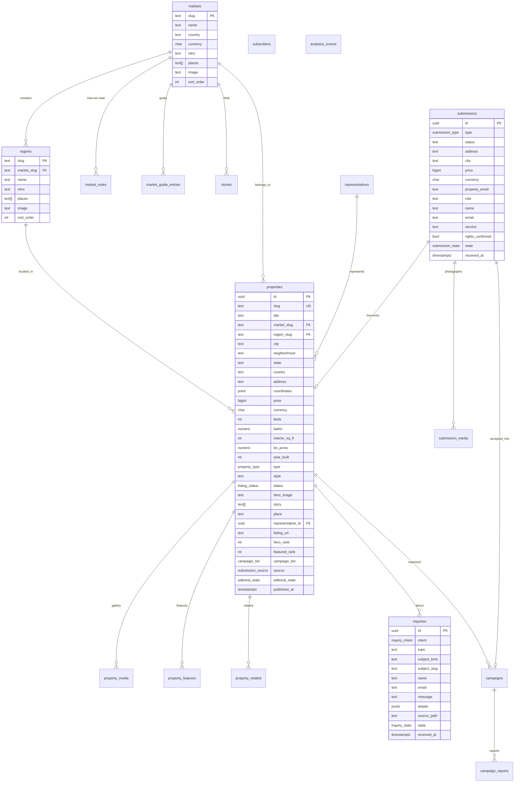

# Data model

> Sketch from the MVP phase. The approved spec is ../../../workspace/02-tech-stack/tech-stack.md and ../../../workspace/06-architecture/architecture.md: read this for intent, build from the spec. Slice B2 replaces this page.

The frontend types in `src/domain/` are the canonical shapes. The database schema in `docs/database/schema.sql` stores the same fields with snake_case columns; the API converts to camelCase JSON at the boundary.

## Entities

### Market, Region

`Market` (`src/domain/market.ts`) is a state-level territory with ordered `regions`, editorial `notes` and a `guide` (neighbourhoods, client needs, local service). Only California, Florida and New York exist; the model supports more but nothing is announced until the owner says so. Region `image` and market `image` are editorial photographs.

### Property

`Property` is the dossier. Notable fields:

- `market`, `region`: slugs, foreign keys.
- `price` in minor units is avoided; store whole currency units as `bigint`, format with `formatPrice` using `currency`.
- `status`: `Illustrative | Active | Off-market | Under offer | Sold`. All current records are `Illustrative`.
- `heroRank`, `featuredRank`: editorial placement on the home page; null means not shown.
- `campaignTier`: `Editorial | Feature | Reach | Campaign`. Paid tiers never change ranking logic; they change distribution outside the site.
- `representation`: optional. Live listings must carry name, brokerage and licence; illustrative ones carry none and the UI says so.
- `related`: hand-picked slugs shown before automatic matches (`relatedProperties` in `lib/catalog.ts`).

Editorial state (`draft | review | published | archived`) lives only in the database; the public API returns published rows.

### Story

`Story` is an editorial piece for one market desk: title, deck, category (`Architecture | Interiors | Places | Stories`), image, body paragraphs and referenced property slugs.

### Editorial gate and campaigns

Submissions move through `Submitted, Under Review, Accepted, Declined, Awaiting Assets, Awaiting Payment, Scheduled, Published, Distribution Active, Completed`. Only editorial leadership (Chief Editorial Officer, Managing Editor) may accept or decline; the `submissions_editorial_gate` trigger blocks every commercial or publishing state until `accepted_at` is set. Products: The Feature $295, The Reach $695, The Campaign $1,495, Five Features $1,250. Programmatic media is separate: from $250, management 15% with a $100 minimum (`campaigns.management_fee`). `campaign_reports` holds the client report metrics.

### Inquiry, Submission, Subscriber

Write-side records defined by Zod in `src/domain/contracts.ts`. `Inquiry.subject` links to a property by slug (kept as text so the record survives if the dossier is archived). `Submission` mirrors the wizard; `submission_media` rows track each photograph and its upload state. A reviewed submission becomes a property by copying fields into `properties` and setting `submissions.property_id`.

### Analytics event

`{ event, path, at, data }`; `event` is one of the names in `AnalyticsEvent`. Used for attribution reports (inquiries per property, package interest, finder usage).

### Exposure schedule

Offerings, add-ons, paid distribution and terms (`src/domain/exposure.ts`, content in `src/data/exposure.ts`) are marketing content owned by the business. They stay in code so Pricing and Exposure can never disagree; move them to a table only if editors need to change prices without a deploy.
