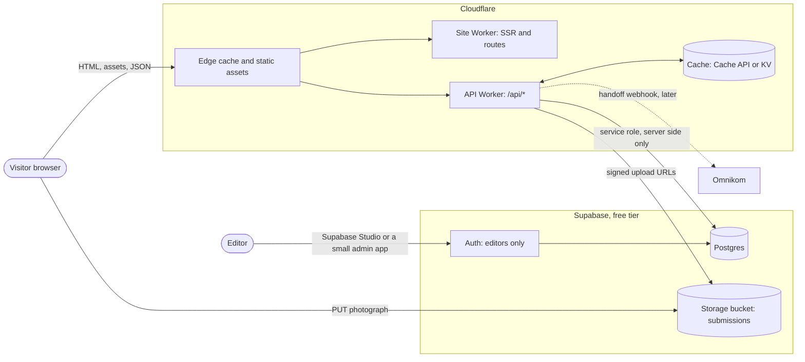
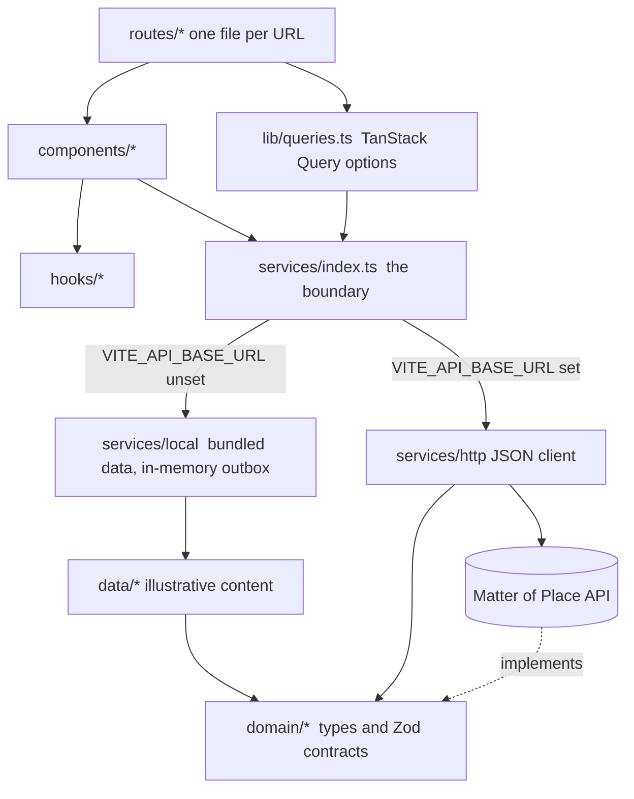
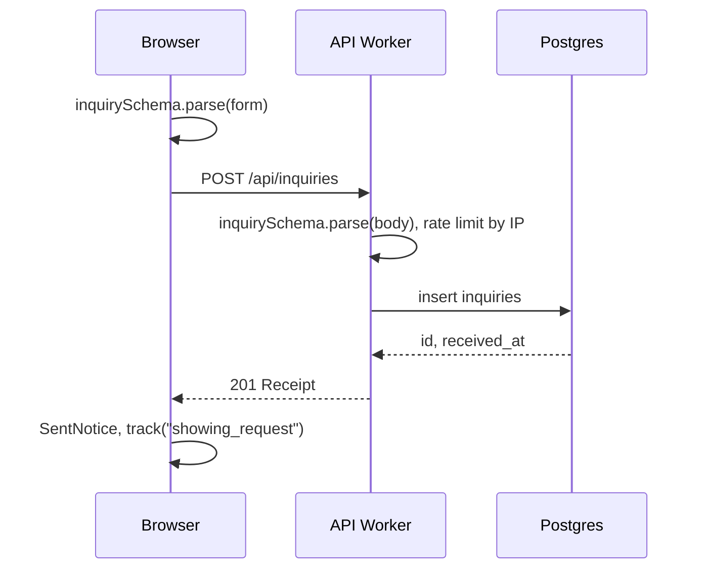
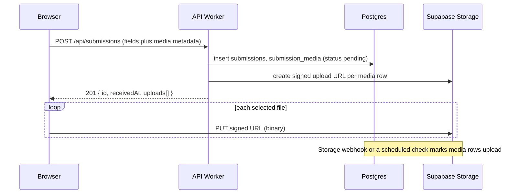

# Architecture overview

Matter of Place is a server-rendered React site (TanStack Start on Vite) with a thin, typed service boundary. Today every service is implemented locally from bundled content; setting one environment variable switches the same interfaces to an HTTP API. The intended production shape is a Cloudflare Worker for the site and API, an edge cache in front of all catalog reads, and Supabase Postgres as the system of record.

## System context



The browser never talks to Supabase directly. Publishable keys are therefore not shipped in the frontend, RLS can stay strict, and the API is free to cache aggressively.

## Frontend layers



Rules that keep the layers honest:

- Routes and components import `services`, never `data/*` directly. The only exceptions are the pricing schedule and FAQ copy, which are static marketing content.
- `domain/contracts.ts` is the single source of write-side validation. The frontend validates before sending; the API imports the same file and validates again.
- Field names in `domain/property.ts`, `domain/market.ts` and `domain/story.ts` equal the JSON the API returns and the columns in `docs/database/schema.sql`, so the HTTP adapter has no mapping layer.

## Read path

```mermaid
sequenceDiagram
  participant B as Browser
  participant E as Edge cache
  participant S as Site Worker (SSR)
  participant A as API Worker
  participant D as Postgres

  B->>E: GET /property/tiburon-waterline
  alt HTML cached (s-maxage 300, stale-while-revalidate 86400)
    E-->>B: HTML
  else miss
    E->>S: render
    S->>A: GET /api/properties/tiburon-waterline
    alt JSON cached
      A-->>S: JSON from Cache API
    else miss
      A->>D: select dossier
      D-->>A: row
      A-->>S: JSON (cached with a tag)
    end
    S-->>E: HTML
    E-->>B: HTML
  end
  B->>B: hydrate; TanStack Query reuses loader data (staleTime 5 min)
```

## Write path (inquiry, subscriber)



## Write path (submission with photography)



## Analytics

`lib/analytics.ts` pushes every event to `window.dataLayer` (tag manager) and, when an API base URL is configured, beacons the same envelope to `POST /api/events`. Events are typed; the API stores them in `analytics_events` for attribution reports.

## What is deliberately not here

- No client-side global state library. Server state is TanStack Query; UI state is local component state.
- No CSS framework. Plain CSS with design tokens (`src/styles/`).
- No authentication in the public site. Editorial work happens in Supabase Studio or a separate admin surface protected by Supabase Auth; see `docs/database/schema.md`.
