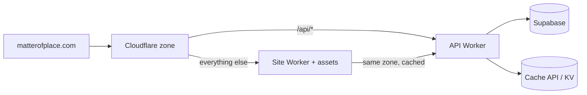

# Deploying on Cloudflare

Two deployables share one zone:

| Piece | Runtime                                                                                              | Source                                                                               |
| ----- | ---------------------------------------------------------------------------------------------------- | ------------------------------------------------------------------------------------ |
| Site  | Cloudflare Worker with static assets (Nitro `cloudflare_module` preset, produced by `npm run build`) | this repository                                                                      |
| API   | Cloudflare Worker on the route `matterofplace.com/api/*`                                             | a sibling repository or `workers/api` in this one; imports `src/domain/contracts.ts` |

Both are optional for local work: the site runs entirely from bundled content when `VITE_API_BASE_URL` is unset.



## Site

1. Build: `npm run build` produces `.output/` with `server/index.mjs` and `public/`.
2. `wrangler.toml` (add at the repository root when leaving the Lovable preview):

   ```toml
   name = "matter-of-place"
   main = ".output/server/index.mjs"
   compatibility_date = "2025-01-01"
   compatibility_flags = ["nodejs_compat"]
   assets = { directory = ".output/public", binding = "ASSETS" }

   [vars]
   VITE_SITE_URL = "https://matterofplace.com"
   VITE_API_BASE_URL = "https://matterofplace.com/api"
   ```

   `VITE_*` values are baked in at build time; set them in CI before `npm run build` rather than relying on runtime vars.

3. Deploy: `npx wrangler deploy`.
4. Cache headers for HTML: `public, s-maxage=300, stale-while-revalidate=86400` (set in the Worker response or with a Cache Rule on the zone). Assets under `/assets/*` and `/media/*`: `immutable, max-age=31536000`.

`src/server.ts` wraps the SSR handler with error reporting and CSRF checks that suit the Lovable preview; keep or simplify it, it is standard TanStack Start.

## API

Recommended stack: Hono on Workers, `zod` from `src/domain/contracts.ts`, `@supabase/supabase-js` with the service role key, Cache API for catalog responses.

Secrets (`wrangler secret put`): `SUPABASE_URL`, `SUPABASE_SERVICE_ROLE_KEY`, `RATE_LIMIT_SALT`, later `OMNIKOM_WEBHOOK_URL`, `OMNIKOM_WEBHOOK_SECRET`.

Endpoints and behaviour: `docs/architecture/services.md`. Caching: `docs/architecture/caching.md`.

Cron Triggers: daily prune of `analytics_events`, a keep-warm read every three days for the free Supabase project, and hourly reconciliation of `submission_media.uploaded_at`.

## Supabase

1. Create a project (free tier). Run `docs/database/schema.sql` in the SQL editor.
2. Add the first admin: sign up an editor in Auth, then `insert into user_roles (user_id, role) values ('<uuid>', 'admin')`.
3. Storage buckets are created by the schema. Set the `submissions` bucket to private (it is), the `media` bucket to public.
4. Seed from `src/data/*.ts` once the seed script exists; rewrite image URLs to Storage or R2.

## Environment variables (frontend)

| Variable             | Required            | Purpose                             |
| -------------------- | ------------------- | ----------------------------------- |
| `VITE_SITE_URL`      | production          | canonical URLs and JSON-LD          |
| `VITE_API_BASE_URL`  | when the API exists | switches every service to live mode |
| `VITE_INSTAGRAM_URL` | optional            | footer link appears only when set   |

Contact email, phone, registered entity and address are typed fields in `src/config/site.ts`, `null` until the owner confirms them. Nothing invented is rendered.

## Pre-launch checklist

- `npm run check` passes (types, lint, formatting).
- Every route renders on desktop and phone without horizontal overflow (a Playwright sweep is documented in `docs/architecture/frontend.md`).
- `head()` metadata is unique per route; verify with a crawler or by viewing source.
- Illustrative content is labelled everywhere; no real listing, agent or price appears without a signed source.
- Rate limits and validation live in the API, not only in the browser.
- Cache purge or version bump runs on publish.
