# Matter of Place

A selective real-estate media platform for exceptional residential property in California, New York and Florida.
We curate it, frame it, publish it, distribute it. A product of Omnikom. Site: matterofplace.com (not live yet).

**Where we are:** the build is running. The website shell, the deploy pipeline, the database (33 tables, policies, functions, seeded with illustrative properties), the public write functions, the job system (runner, cron, health) and the creative render scripts are on `main` and deploy themselves to a dev address on every merge. The public API, the admin portal, email, social posting, the newsletter and the audit robot are being built now, one proven step at a time; every step is reviewed by a fresh agent and merged through a gate. Production shows nothing until the launch switch. The numbers below come from the build board and are rewritten with every update.

<!-- progress:start -->
**Progress (updated 2026-10-05, from the build board):** 121 of 259 planned steps accepted (46.7%), 5 of 22 slices closed, 7 steps in work.

| Arm | To launch | What it covers |
|---|---|---|
| Website | 56.6% | pages, forms, the public API they call, SEO, legal pages |
| Admin portal | 48.8% | screens, actions, roles and permissions |
| Backend logic and automation | 53.5% | jobs, recipes, cross-wiring, content pipelines, email |
| Database | 55.8% | tables, functions, triggers, policies, migrations |
| Deployment and operations | 61.6% | CI, deploys, backups, monitoring, the launch switch |

| Slice | What | Accepted | |
|---|---|---|---|
| B2 | Database | 15 of 15 | 100% |
| B3 | API | 18 of 18 | 100% |
| B3b | Coming-soon mode | 10 of 10 | 100% |
| B4 | Tests | 10 of 10 | 100% |
| B15 | Omnikom handoff | 7 of 7 | 100% |
| B1b | Repo and delivery | 14 of 16 | 87.5% |
| B5 | Email | 5 of 10 | 50% |
| B7 | Admin workspace | 1 of 20 | 5% |
| B8 | Job system | 11 of 14 | 78.6% |
| B8b | Automation console | 6 of 11 | 54.5% |
| B9 | Creative system | 9 of 11 | 81.8% |
| B12 | Reel | 3 of 9 | 33.3% |
| B13 | SEO, AEO, GEO | 4 of 13 | 30.8% |
| B14 | Audit robot | 3 of 9 | 33.3% |
| B16 | Legal identity | 2 of 8 | 25% |
| B17 | Website essentials and compliance (the must-haves of any professional site) | 3 of 12 | 25% |

Not started yet: B6 (Money box), B10 (Social publishing), B11 (Newsletter), H1 (HARDEN checklist), H2 (Acceptance panel: the whole site walked through by three senior agents), L1 (LAUNCH).
<!-- progress:end -->

How the build works: 22 plans (`workspace/05-plans/`) broken into steps, each with a proof; lanes build in parallel on this laptop, a reviewer in a fresh context tries to refute each group, a merge gate refuses anything without green checks, and an acceptance panel (plan H2) walks the finished site end to end before launch. Decisions: [PROJECT-STATE.md](PROJECT-STATE.md). Things that already bit us: [GOTCHAS.md](GOTCHAS.md). Position of the work: [.claude/POSITION.md](.claude/POSITION.md).

## The whole system in one picture
Solid boxes exist today; dashed boxes are what we build.

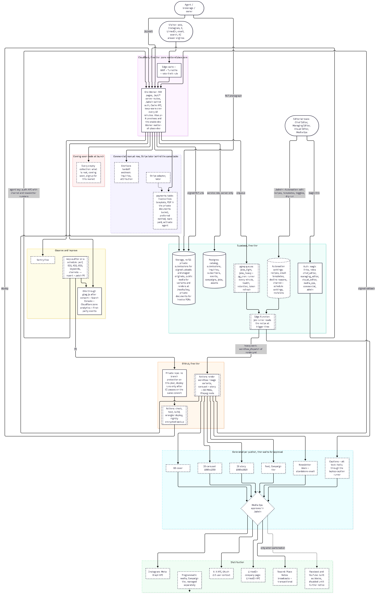

## What an agent's submission goes through (one click per step for us)

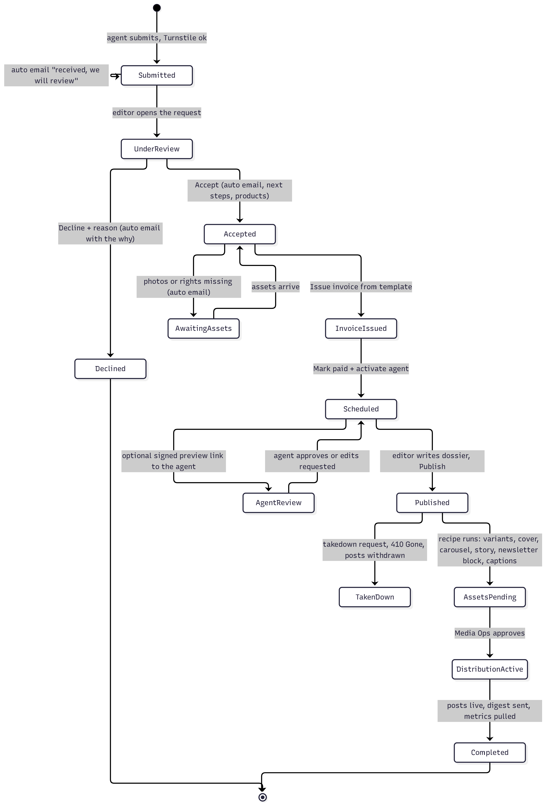

## The road to live
Eight waves, in order. Each wave is a folder of plans a builder can execute without asking questions.

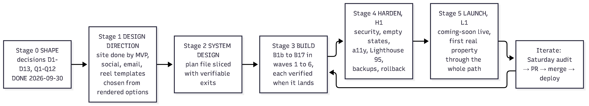

| Wave | What gets built | Result you can see |
|---|---|---|
| 1 | Repo and delivery: deploy pipeline, previews per change, error monitoring | the site deploys itself on every merge |
| 2 | Database, API, coming-soon mode, tests | forms save real records; empty markets say "coming soon" with a signup |
| 3 | Email, admin workspace, job system, website essentials | we review submissions with one click, emails go out by themselves; headers, consent, accessibility, feeds, icons and error pages meet a professional bar |
| 4 | Money box, automation console, legal identity | invoices from a template; automations adjustable from the admin without a developer |
| 5 | Creative system, social posting, newsletter, reel | a published property becomes a carousel, story, newsletter block and, for Campaign, a reel |
| 6 | SEO / AEO / GEO, weekly audit robot, Omnikom handoff | found by search and AI answer engines; a Saturday report with fixes |
| 7 | Harden | security, backups, rollback, performance |
| 8 | Launch | DNS cut-over, first real property end to end, watch week |

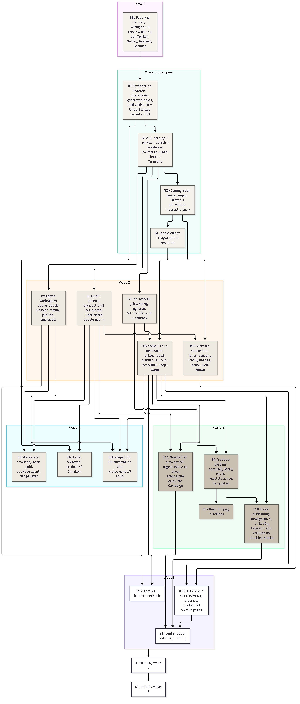

## What the admin portal will be
25 screens in six groups. Automations are settings in the database, changed from the console, not code.

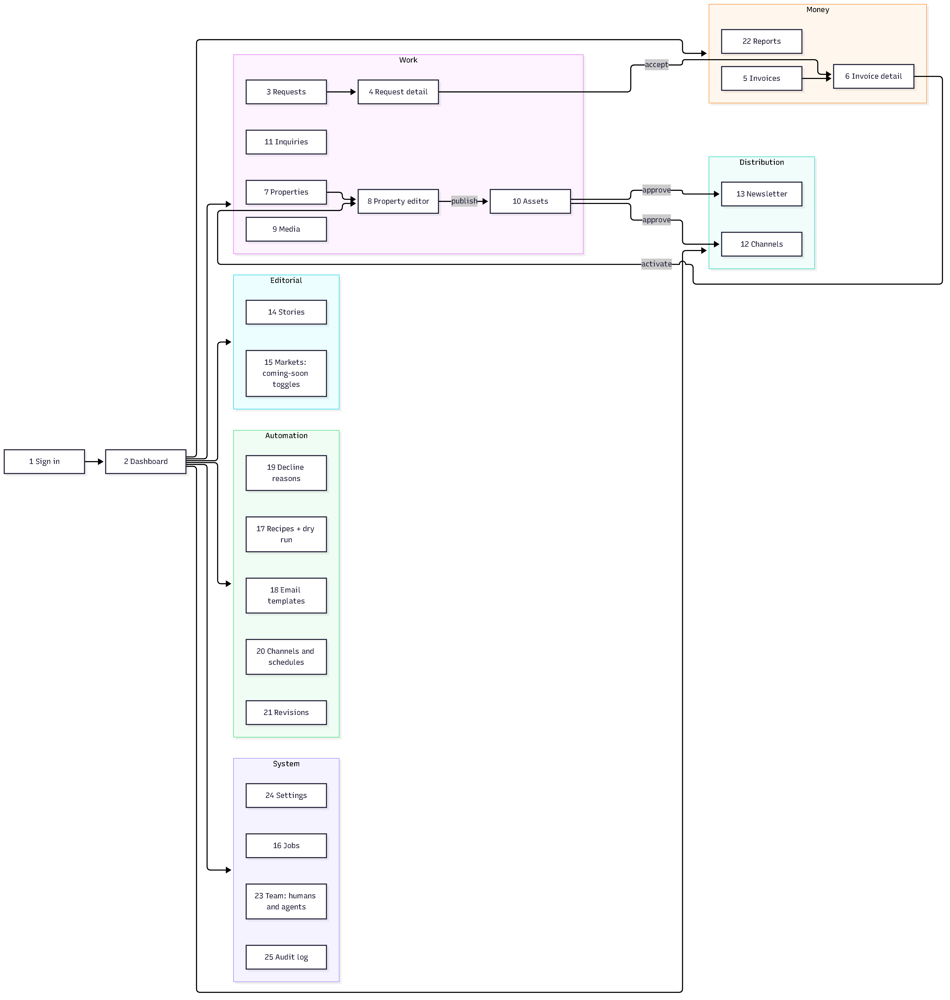
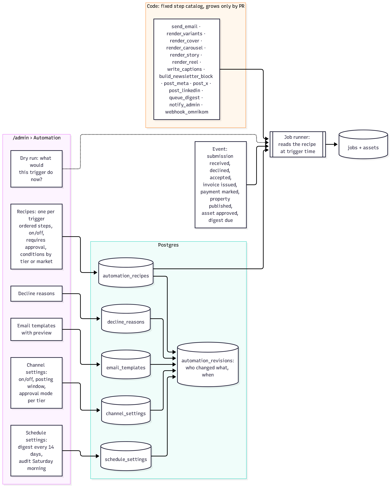

## The automations
Every trigger and what it fires. Recipes are settings we edit in the admin, not code; a human approves generated
assets before anything posts (first 60 days), and every change is versioned.

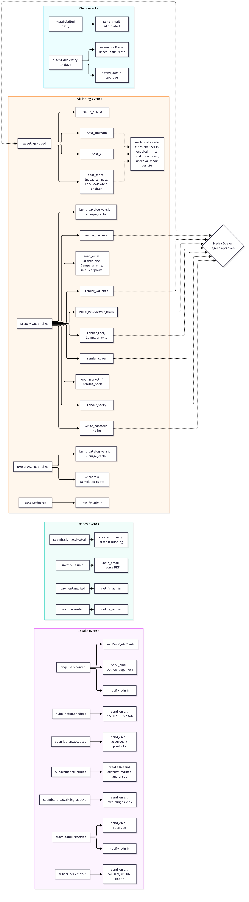
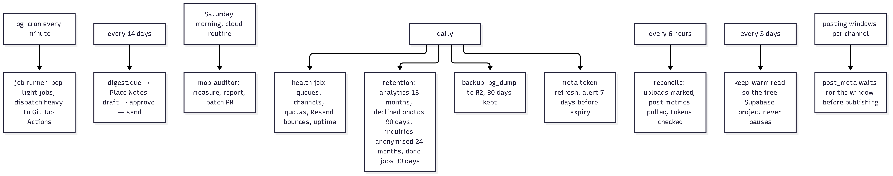

More: [job lifecycle](workspace/03-diagrams/img/architecture-3.png) · [publish pipeline](workspace/03-diagrams/img/plans-c-1.png) ·
[recipe engine](workspace/03-diagrams/img/plans-b-3.png) · [weekly audit loop](workspace/03-diagrams/img/big-diagram-3.png) ·
[who can change what](workspace/03-diagrams/img/automations-3.png)

Public pages are served from cache and do not query the database when warm: [what a visitor's request touches](workspace/03-diagrams/img/architecture-5.png).

## Website essentials
What every professional site must serve, and how consent and headers work here (plan B17).

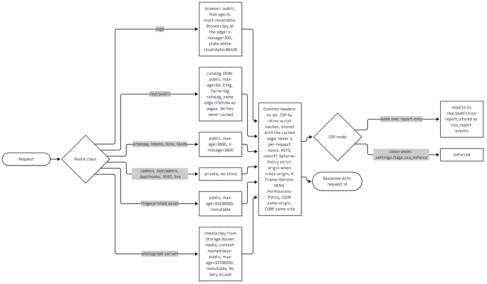
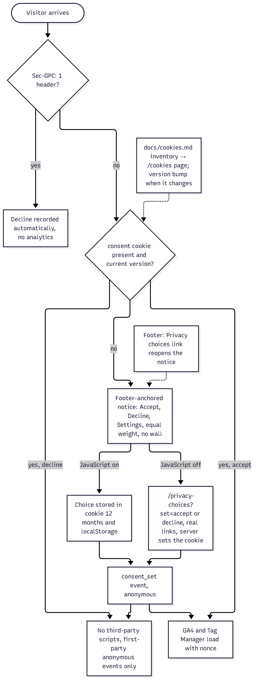
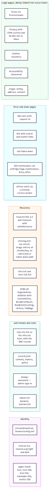

## The database
Built and seeded on `mop-dev` (slice B2 closed 2026-10-03). Every table, column, permission and trigger is specified in [workspace/06-architecture/architecture.md](workspace/06-architecture/architecture.md) §3,
and the migration files are listed in order in [workspace/05-plans/B2.md](workspace/05-plans/B2.md). Groups: catalog
(markets, regions, properties, media, stories) · people and audit (roles, agent keys, audit log) · intake (submissions,
inquiries, subscribers with market interest, analytics) · commercial (payments, campaigns, reports) · automation as data
(recipes, email templates, decline reasons, channel and schedule settings, revisions) · jobs and generated assets
(events, jobs, assets, social posts, newsletter issues).

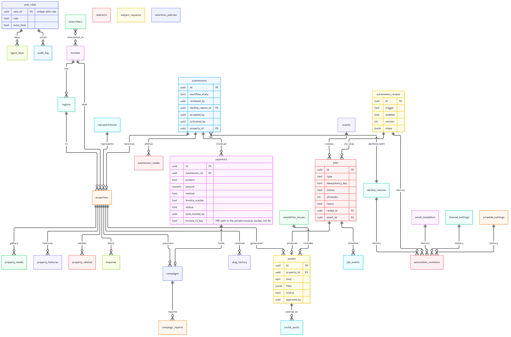

## Accounts and inputs we still need (owner side)
| Need | Status | Used by |
|---|---|---|
| matterofplace.com | done: registered at Namecheap, DNS on Cloudflare nameservers | everything |
| Cloudflare | done: account under admin@matterofplace.com, zone active on Free, mail records imported, TLS and security hardened, deploy token and owner token issued. Previews use holy-meadow-4327.workers.dev | wave 1 |
| Storage (photos, uploads, documents) | done: Supabase Storage buckets, no R2 (decision S57) | waves 2, 5, 7 |
| GitHub | done: private repository, Actions enabled and secrets set. No branch protection and no Environments on this plan, so merge review is the gate | wave 1 |
| Turnstile | done: widget "matterofplace.com forms" | wave 2 |
| Company email | done: Zoho Mail free plan, admin@matterofplace.com sends and receives; SPF, DKIM, DMARC set | everything |
| Supabase (database) | done: one project `mop-dev`, the build database now and production after the launch switch (decision S60); 33 tables, policies, functions, cron and the job runner deployed | everything |
| Resend (email) | done: team, three verified sending domains, dev key and webhook; real sends come with slice B5 | wave 3 |
| Sentry (errors) | done: organisation and project created, errors only | wave 1 |
| Google: GA4, Search Console | accounts exist (decision S64); wired in slices B13 and B14 | wave 6 |
| X developer app, LinkedIn page and app | after launch (decision S64): the channels ship as switched-off blocks | after launch |
| Anthropic API key | none, by decision S58: captions are written through the operator's Claude account by a runner on the laptop | wave 5 |
| Meta Business + Instagram Business | after launch, through the partner (decision S64) | after launch |
| Legal entity name and address | deferred until the lawyer confirms; invoices are blocked until set | wave 4 |
| Instagram handle | when Dave creates it | wave 5 |
| Payment methods for invoices | set later in admin Settings | wave 4 |

## Decisions that shape everything
Free tier first, pay only when a measured limit is hit · no music ever in films, sound design only · launch is coming-soon
until the first real property · payments are manual invoices now, Stripe later behind the same table · agents (AI) can
work the admin portal until humans are hired · Instagram, X and LinkedIn at launch (Facebook and YouTube built as switched-off blocks), human approval on posts for 60 days ·
newsletter every two weeks · audit robot every Saturday morning.
Full ledger: [PROJECT-STATE.md](PROJECT-STATE.md). Things that already bit us: [GOTCHAS.md](GOTCHAS.md).

## Folder map
| Folder | What |
|---|---|
| `app/` | the site (React, TanStack Start, plain CSS, Cloudflare Worker) |
| `workspace/00-MAP-OF-WHAT-WE-HAVE.md` | the company and what exists today |
| `workspace/02-tech-stack/` | the approved stack and the rule for adding anything |
| `workspace/03-diagrams/img/` | every diagram as a picture |
| `workspace/04-completion-map/` | the road, in words |
| `workspace/05-plans/` | 22 plans to file level, PLAN.md order, ASSUMED.md rulings, the build board (`board.mjs`), the sizing per slice, check-plans.mjs consistency check |
| `workspace/06-architecture/` | the engineering architecture |
| `workspace/07-admin-platform/` | the 25 admin screens |
| `workspace/08-visual-pass/` | the site visual audit and fixes (merged) |
| `launch/` | the launch film work (paused), motion bible, gate |
| `brand/` | the brand assets: logo (emblem, wordmark, lockups) as SVG and PNG, icons, palette, the four typefaces; `brand/README.md` describes every file; regenerate with `node launch/tools/brand-build.mjs` |
