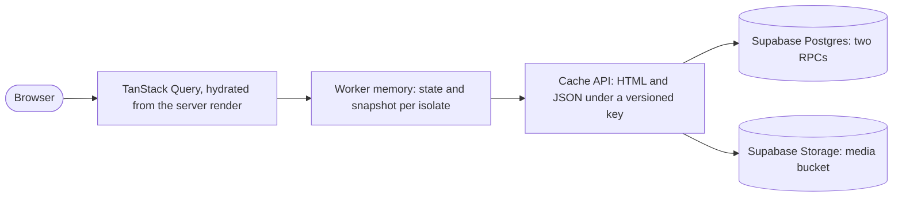

# Caching strategy

> Built by slice B3. The contract is architecture section 13 (S52, F24) in `../../../workspace/06-architecture/architecture.md`; the runbook with the commands is `../runbooks/api.md`. A warm public read costs zero database queries, so the Supabase free tier carries the whole catalog.

## Layers

| Layer          | What                                                                     | Lifetime                                                   | Invalidation                           |
| -------------- | ------------------------------------------------------------------------ | ---------------------------------------------------------- | -------------------------------------- |
| TanStack Query | loader data, dehydrated by the server render and hydrated in the browser | `staleTime` 5 min (`lib/queries.ts`)                       | page reload                            |
| Worker memory  | `public_state()` and the mapped catalog snapshot, per isolate            | the state is re-read every 15 s (`CATALOG_VERSION_TTL_MS`) | the catalog version changes            |
| Cache API      | `html`, `json` and `doc` responses, and `/media/<key>` files             | `s-maxage=31536000` on the stored copy                     | none needed: the key holds the version |
| Assets         | fingerprinted JS, CSS and imported images                                | `immutable, max-age=31536000`                              | a new build gives new file names       |

## The key

`https://cache.mop.internal/<release>/v<catalogVersion>/<kind>/<pathname>`: `release` is `SENTRY_RELEASE` (the commit SHA), `kind` is `html`, `json` or `doc` (sitemap, robots, llms files and feeds). The query string is dropped, and no cookie or request header ever changes the key, so a stored page is one pure function of (release, version, path). A publish, an unpublish or a change of a public setting bumps `catalog_version` in the database; the next state check sees it and every key changes within 15 seconds. Nothing is purged.

## What a stored entry keeps

The body, `content-type`, `etag`, `x-catalog-version`, the `Content-Security-Policy` (or `-Report-Only`) header with the hashes of that page's inline scripts, and the `Link` header with the preloads, so a hit and a miss answer with the same policy. It never holds `x-request-id`, `Set-Cookie` or a static security header: the pipeline adds those after the lookup. Never stored: any non-GET request, any `no-store` response, any response with `Set-Cookie`, any 5xx. The stored copy has the long edge lifetime; every response that leaves the Worker carries the short browser lifetime (`public, max-age=60` for JSON, `max-age=0, must-revalidate` for pages), so no shared cache outside Cloudflare holds a page for a year. The catalog 404 (and the 410 of a taken-down property) is `public, s-maxage=60`.

## Last good copy

When the database cannot be read, or does not answer within 2 seconds, the last good state and snapshot answer, and a last good copy of the response answers with `x-mop-cache: stale`. A page's last good key holds the release, because an HTML page names the hashed files of its own build; JSON and documents name no file, so their key does not. With no last good copy at all the answer is 503 `unavailable`. The post-deploy smoke test fails on `stale` (DO-09).

## `x-mop-cache`

`hit` came from the edge cache, `miss` was built and stored, `stale` is the last good copy, `bypass` was never stored (writes, errors answered before the service, `no-store`). Every public GET also carries `x-catalog-version`. The Cache API does nothing on `workers.dev` and in `vite dev`: a preview answers `miss` every time and runs on the memory layer alone.

## Rules for the API

1. Catalog endpoints are pure functions of the snapshot. They run no query of their own: the two RPCs `public_state()` and `public_catalog_snapshot()` are the only database reads on a public request.
2. Writes bypass every cache and never read the catalog.
3. The catalog routes accept no query parameter, so the whole query string is dropped from the key.
4. `/properties?q=` renders the full list on the server and applies the term in the browser after hydration, so one stored page serves every visitor.

## Media

A photograph is served at `/media/<key>` from the public `media` bucket of the one Supabase project, keyed by a content hash, so a stored file never changes (`public, max-age=31536000, immutable`). Variants are made once, when a photograph is attached.

## Prove it

Under local `bunx wrangler dev` the Cache API works, so `node scripts/cache-proof.mjs http://127.0.0.1:8788` proves the edge layer: `miss` then `hit`, the same answer for any query string, 304 for `If-None-Match`, the stored 404, `bypass` for a write, the page and its policy headers, and the full list under `/properties`. The steps, with the media check, are in `../runbooks/api.md`. The custom domain and the 95 percent hit ratio are confirmed at launch and measured by H1.
