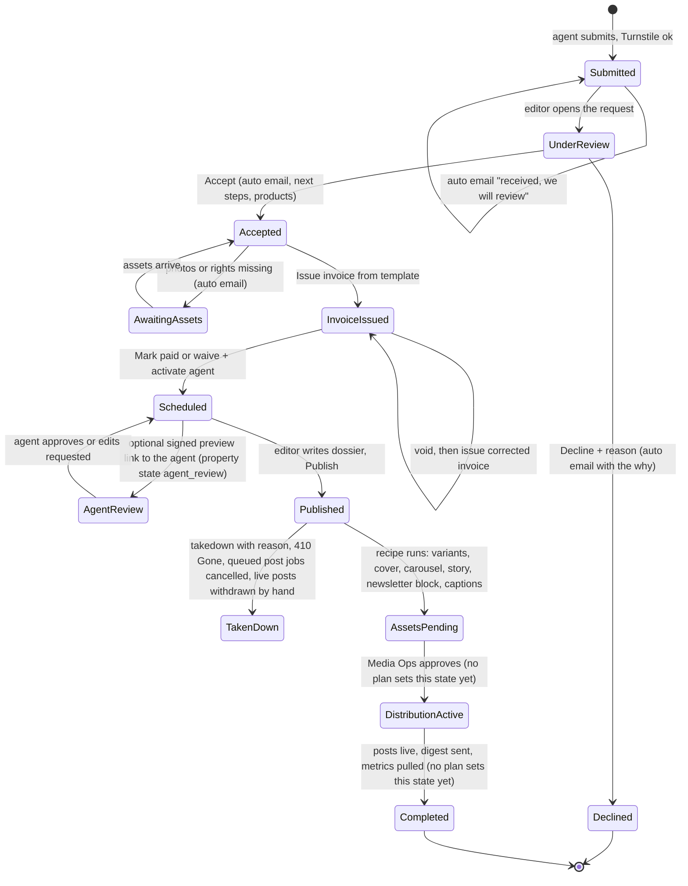
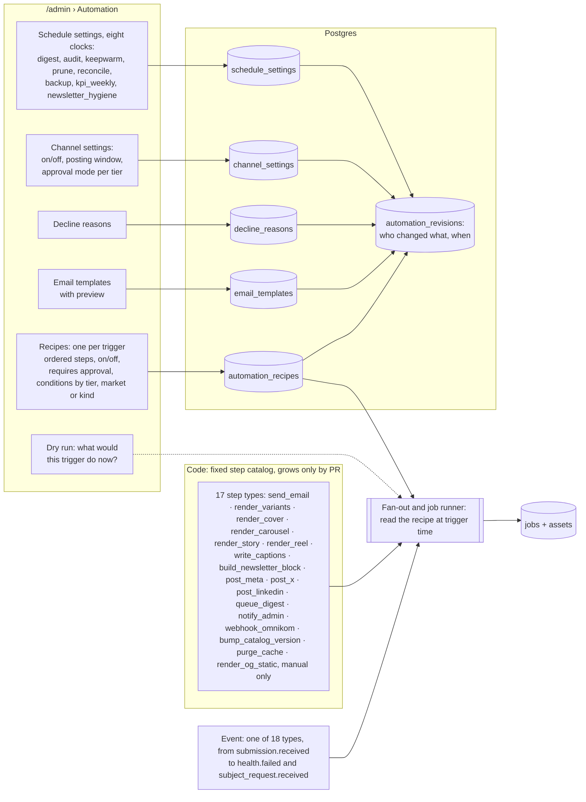
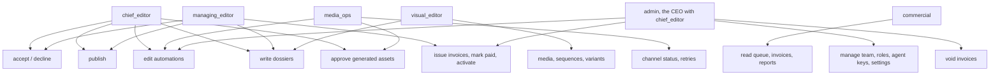

# The admin operating system, as diagrams

Pictures: [img/admin-os-1.png](img/admin-os-1.png) (a submission's life, one click per step),
[img/admin-os-2.png](img/admin-os-2.png) (how automations are stored and changed from the console),
[img/admin-os-3.png](img/admin-os-3.png) (what each role can do).

## 1. A submission's life in /admin

## 2. Automations as settings

## 3. Roles

