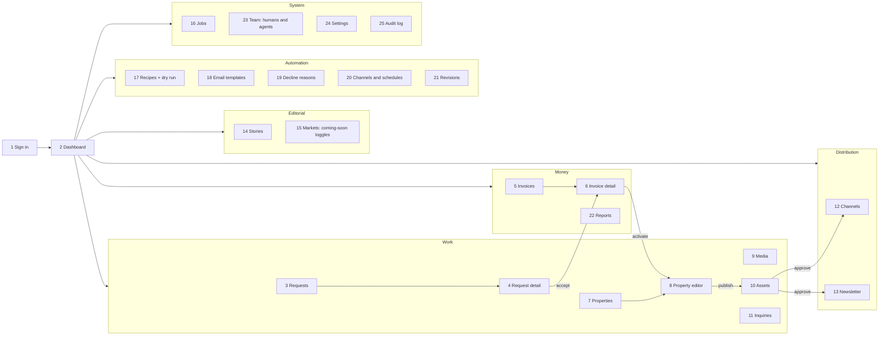
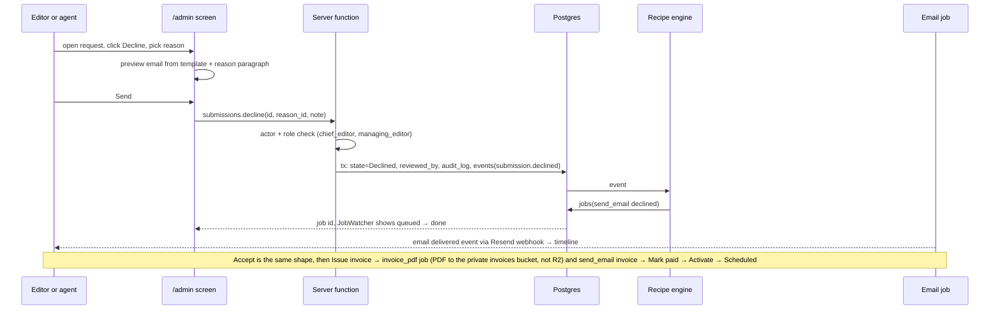
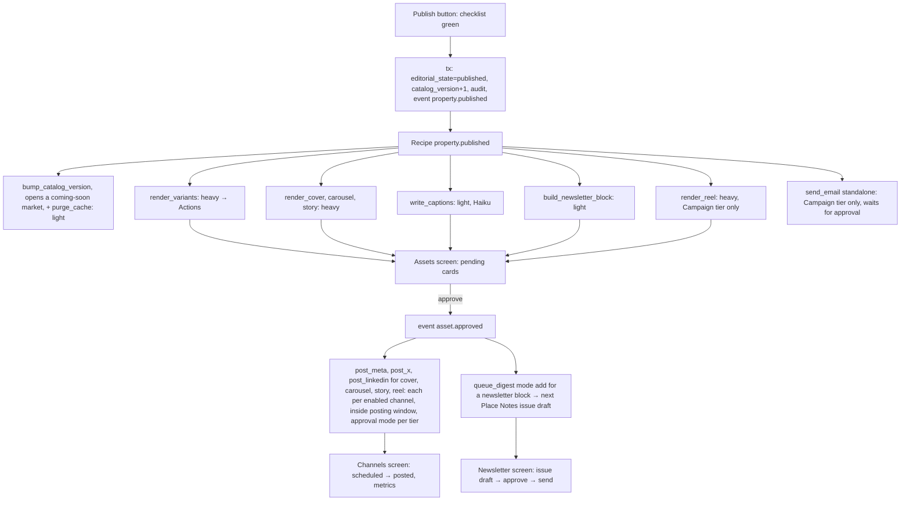

# Admin platform diagrams

Pictures: [img/admin-screens-1.png](img/admin-screens-1.png) navigation map, [img/admin-screens-2.png](img/admin-screens-2.png)
decide-and-invoice flow, [img/admin-screens-3.png](img/admin-screens-3.png) publish-to-channels flow.
Words: `../07-admin-platform/admin-screens.md`.

## 1. Navigation map (25 screens)

## 2. Decide and invoice (screens 4 and 6)

## 3. Publish to channels (screens 8, 10, 12, 13)

