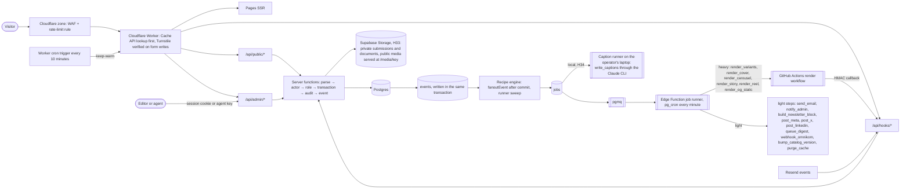
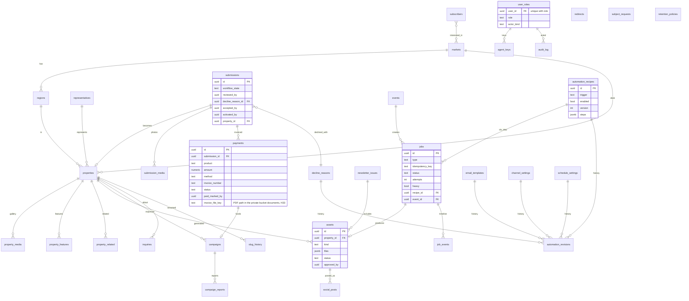
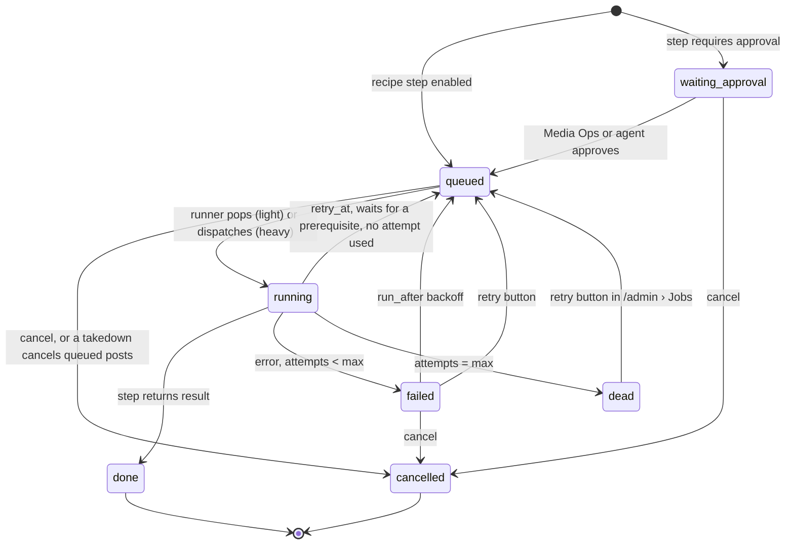
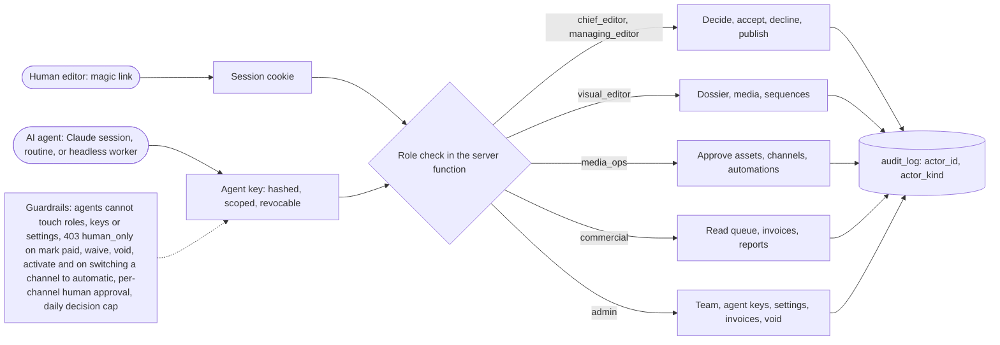
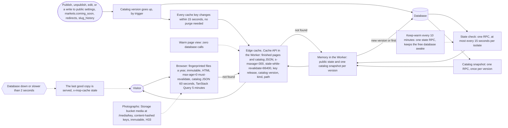

# Architecture diagrams

Pictures: [img/architecture-1.png](img/architecture-1.png) request paths, [img/architecture-2.png](img/architecture-2.png) data model v2,
[img/architecture-3.png](img/architecture-3.png) job lifecycle, [img/architecture-4.png](img/architecture-4.png) agents as staff, [img/architecture-5.png](img/architecture-5.png) caching.
Words: `../06-architecture/architecture.md`.

## 1. Request paths

## 2. Data model v2

## 3. Job lifecycle

## 4. Agents as staff

## 5. Caching: what a visitor's request touches

