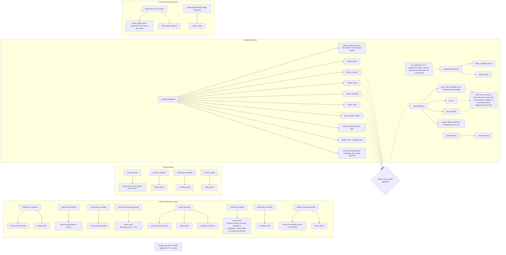
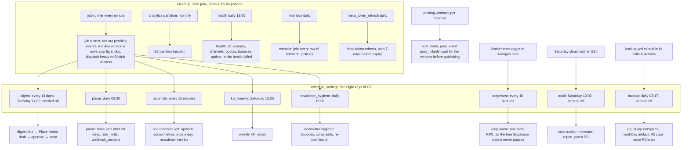
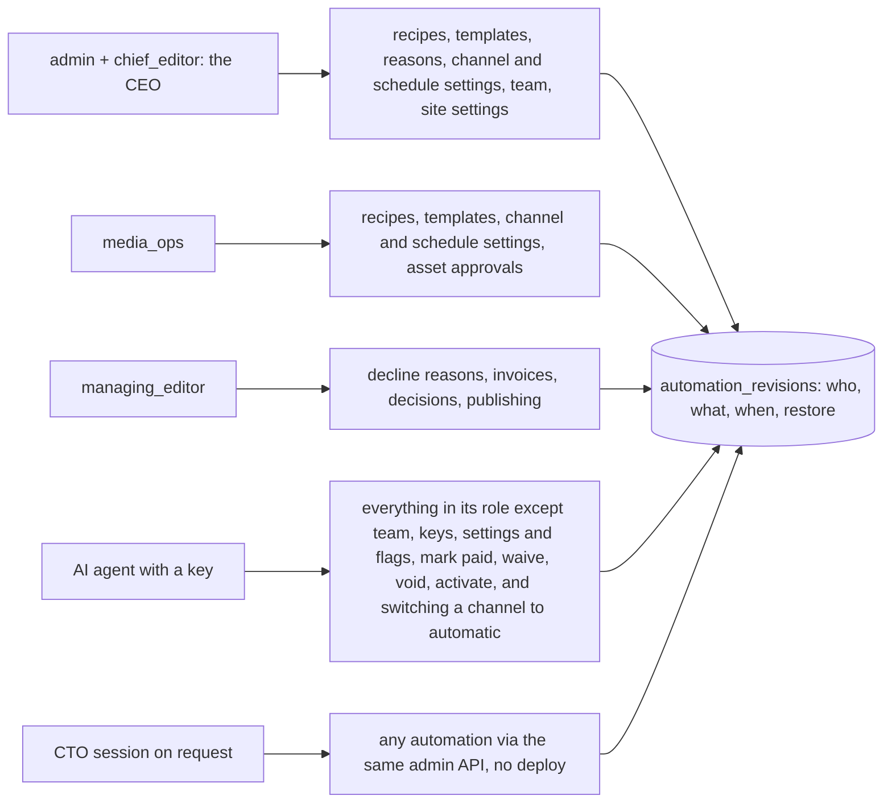

# Automation maps

Pictures: [img/automations-1.png](img/automations-1.png) every trigger and the steps it fires by default,
[img/automations-2.png](img/automations-2.png) the clocks, [img/automations-3.png](img/automations-3.png) who can change what.
Related: admin-os-2 (automations as settings), architecture-3 (job lifecycle), plans-b-3 (recipe engine), plans-c-1 (publish pipeline), big-diagram-3 (audit loop).
All of this is data in the database, editable from Admin › Automation; a step type is code, a recipe is a setting.

## 1. Every trigger and its default recipe (18 events, 17 step types)

Source: the seed list of `05-plans/B8b.md` (Data changes, `<ts>_automation_seed.sql`) and architecture 5. One recipe row per event;
an event with no default step still has its row (enabled, empty, editable). `render_og_static` is the seventeenth step type and is
in no recipe: it runs only on a manual trigger.

## 2. The clocks

Fixed pg_cron jobs are architecture 5 item 8. Every other clock is one of the eight `schedule_settings` rows of ruling G9, each
pausable on screen 20; cron values are UTC. `prune`, `reconcile`, `digest`, `kpi_weekly` and `newsletter_hygiene` are run by
`runDueSchedules` on each runner tick; `keepwarm`, `audit` and `backup` are external clocks whose row must equal the clock that fires.

## 3. Who can change what

