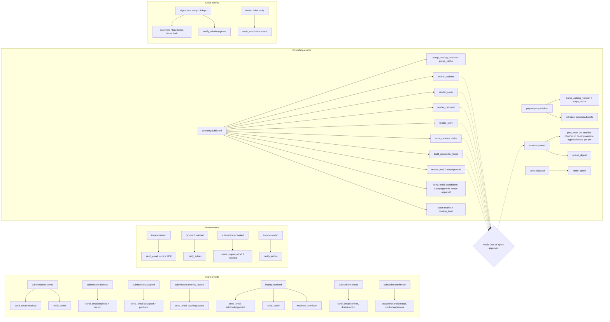
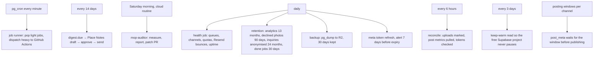
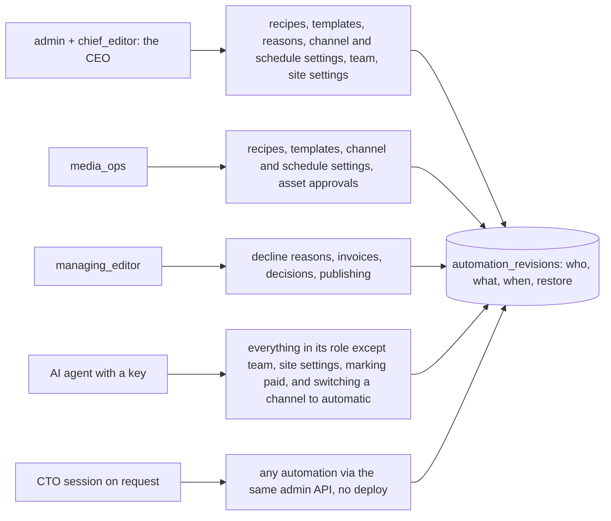

# Automation maps

Pictures: [img/automations-1.png](img/automations-1.png) every trigger and the steps it fires by default,
[img/automations-2.png](img/automations-2.png) the clocks, [img/automations-3.png](img/automations-3.png) who can change what.
Related: admin-os-2 (automations as settings), architecture-3 (job lifecycle), plans-b-3 (recipe engine), plans-c-1 (publish pipeline), big-diagram-3 (audit loop).
All of this is data in the database, editable from Admin › Automation; a step type is code, a recipe is a setting.

## 1. Every trigger and its default recipe (17 events, 14 step types)

## 2. The clocks

## 3. Who can change what

