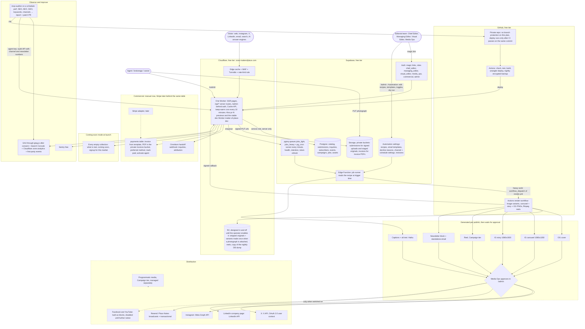
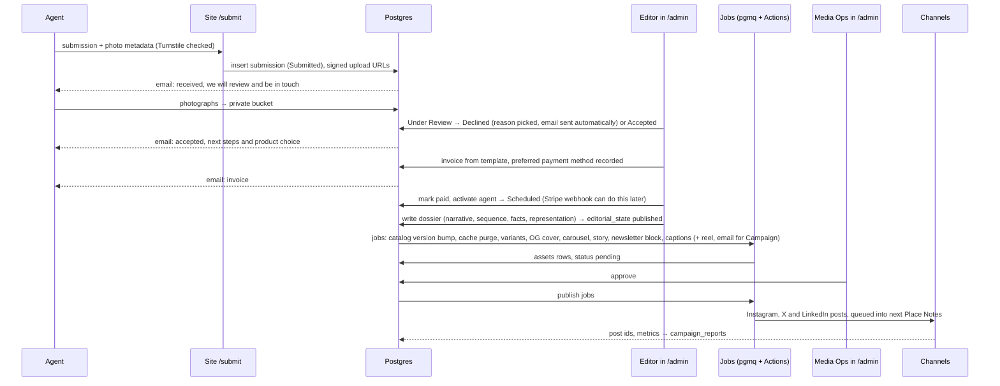
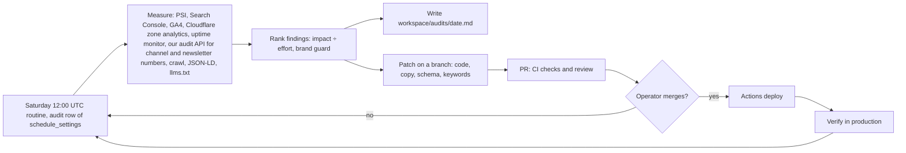
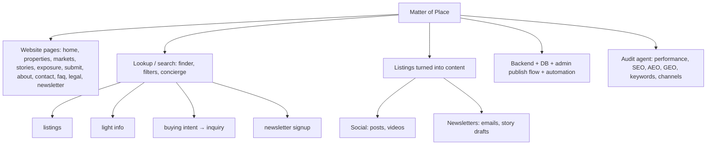

# The big diagram — Matter of Place end to end (approved stack, 2026-09-30)

**Pictures (open these, not the code):**
- [img/big-diagram-1.png](img/big-diagram-1.png) — the whole system map
- [img/big-diagram-2.png](img/big-diagram-2.png) — how an admin deploys a listing, step by step
- [img/big-diagram-3.png](img/big-diagram-3.png) — the weekly audit and upgrade loop
- [img/big-diagram-4.png](img/big-diagram-4.png) — the notebook page as a tree

SVG versions sit next to each PNG. After editing any diagram below, run `node render.mjs` in this folder to refresh the pictures.

Solid boxes exist today; dashed boxes are not built. Free tier everywhere unless a box says otherwise.

## 1. System map

## 2. How an admin deploys a listing

## 3. The audit and upgrade loop

## 4. The notebook page, as a tree

