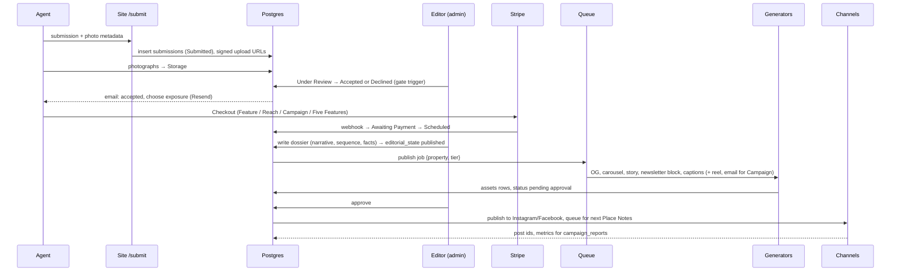
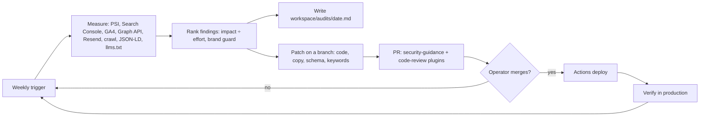
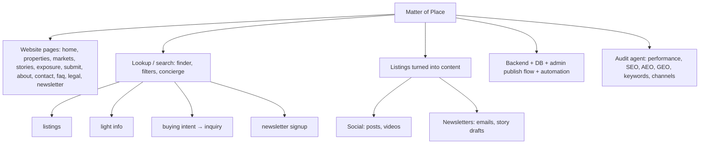

# The big diagram — Matter of Place end to end (DRAFT)

Mermaid; renders on GitHub and in most markdown viewers. Solid boxes exist today; dashed boxes are not built.
Sub-diagrams follow for the three flows the notebook page asks about: publish a listing, generate everything, audit and upgrade.

## 1. System map

```mermaid
flowchart TB
  visitor([Visitor: web, Instagram, email, search, AI answer engines])
  agent([Agent / brokerage / owner])
  editor([Editorial team: CEO, Managing Editor, Visual Editor])

  subgraph CF[Cloudflare zone matterofplace.com]
    edge[Edge cache + WAF + Turnstile + rate limits]
    site[Site Worker: SSR pages, /api/* server routes]
    cache[(Cache API / KV: catalog by catalog_version)]
    r2[(R2: published photography)]
    img[Image Resizing /cdn-cgi/image]
    queue[[Queue: publish jobs]]:::todo
    cron[[Cron: prune events, keep-warm, reconcile uploads, weekly digest]]:::todo
    render[Browser Rendering: HTML → PNG]:::todo
  end

  subgraph SB[Supabase]
    db[(Postgres: catalog, submissions, inquiries, subscribers, events, campaigns)]
    auth[Auth: editors, user_roles]
    store[(Storage: submissions bucket, signed uploads)]
  end

  subgraph GEN[Content generation: scripts first, AI only for words]:::todo
    og[OG image]
    car[IG carousel 1080x1350]
    story[IG story 1080x1920]
    reel[Reel: ffmpeg Ken Burns]
    nl[Newsletter block + standalone email]
    cap[Captions + alt text: Haiku]
    approve{Editor approval}
  end

  subgraph OUT[Distribution]:::todo
    ig[Instagram + Facebook: Meta Graph API]
    pin[Pinterest / LinkedIn: month two]
    resend[Resend: Place Notes broadcast + transactional]
    prog[Programmatic media: display, native, OLV, CTV, DOOH]
  end

  subgraph MONEY[Commercial]:::todo
    stripe[Stripe Checkout after acceptance + webhook]
    omni[Omnikom handoff webhook: inquiries, attribution]
  end

  subgraph OBS[Observe and improve]
    ga[GTM + GA4 + first-party analytics_events]
    sc[Search Console + Bing]:::todo
    sentry[Sentry]:::todo
    auditor[[mop-auditor weekly: perf, SEO, AEO, GEO, keywords, channels]]:::todo
    gh[GitHub: PRs, Actions: check, build, wrangler deploy]:::todo
  end

  visitor --> edge --> site
  site <--> cache
  site -->|service role, server only| db
  site -->|signed PUT urls| store
  visitor -->|PUT photograph| store
  site --> img --> r2
  agent -->|/submit| site
  editor -->|review, accept, publish| auth --> db
  db -->|publish trigger| queue --> GEN
  render --> og & car & story
  cap --> approve
  og & car & story & reel & nl --> approve
  approve --> ig & pin & resend
  approve --> r2
  db --> stripe --> db
  site --> omni
  site --> ga
  auditor --> ga & sc & ig & resend
  auditor -->|report + patch PR| gh -->|deploy| site
  prog -.->|campaign tier only| OUT

  classDef todo stroke-dasharray: 5 5;
```

## 2. How an admin deploys a listing (the question on the notebook page)



## 3. The audit and upgrade loop



## 4. The notebook page, as a tree


