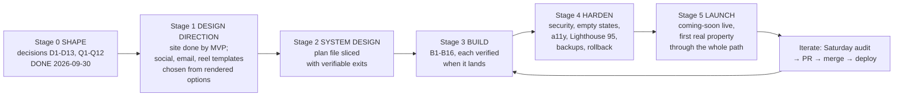
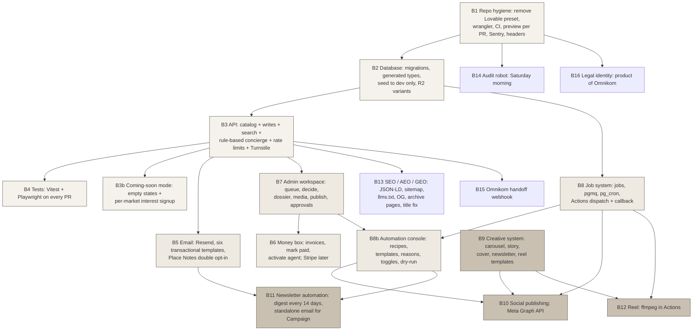
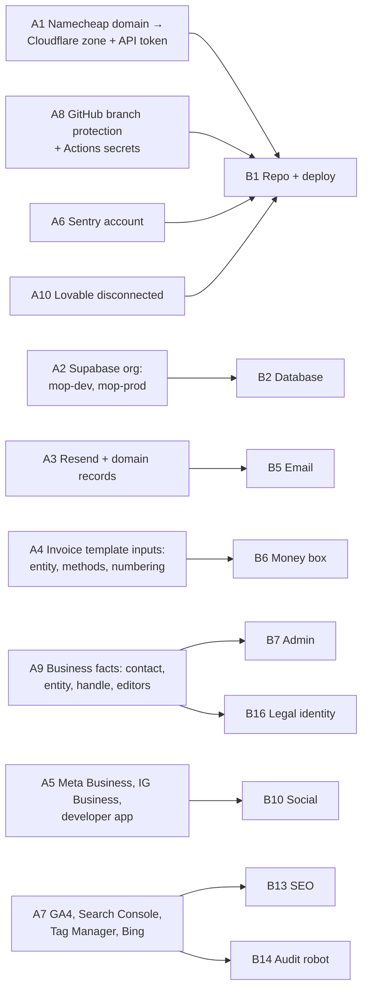

# The road to the finish line, as diagrams

Pictures: [img/completion-map-1.png](img/completion-map-1.png) (stages and gates), [img/completion-map-2.png](img/completion-map-2.png)
(build slices and what depends on what), [img/completion-map-3.png](img/completion-map-3.png) (what you set up before each slice).
Source of truth for the words: `../04-completion-map/completion-map.md`.

## 1. Stages and gates

## 2. Build slices and dependencies

## 3. What the owner sets up, and which slice waits for it

