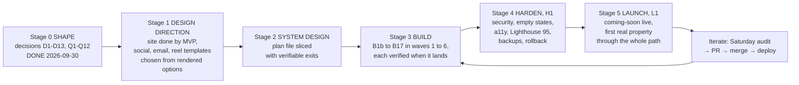
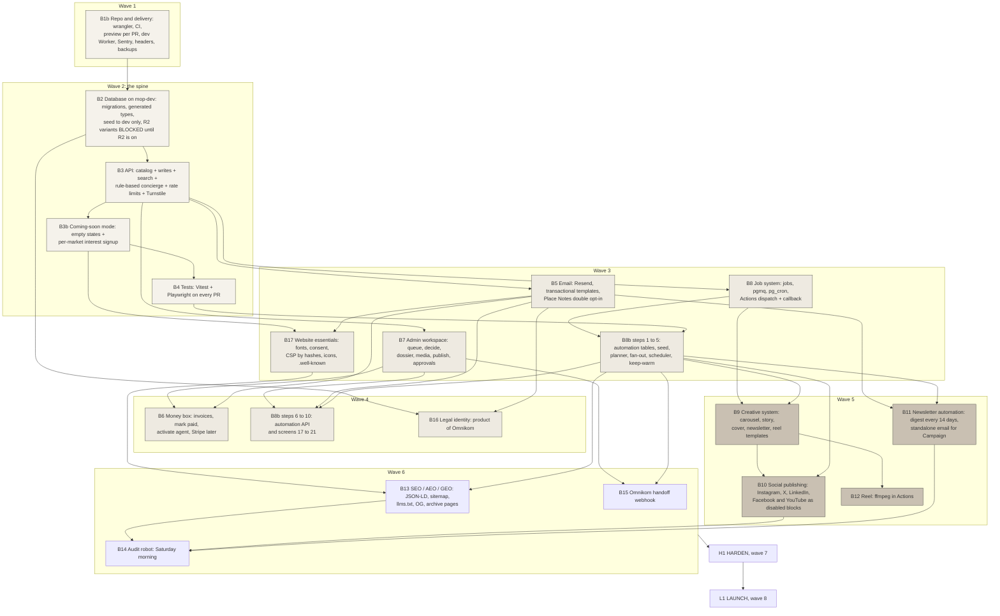
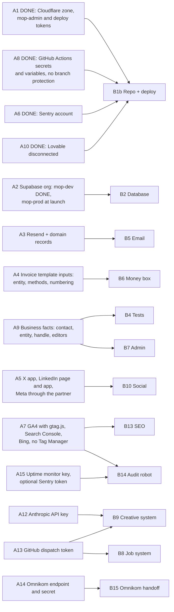

# The road to the finish line, as diagrams

Pictures: [img/completion-map-1.png](img/completion-map-1.png) (stages and gates), [img/completion-map-2.png](img/completion-map-2.png)
(build slices and what depends on what), [img/completion-map-3.png](img/completion-map-3.png) (what you set up before each slice).
Source of truth for the words: `../04-completion-map/completion-map.md`.

## 1. Stages and gates

## 2. Build slices, waves and dependencies

Waves are `05-plans/PLAN.md`. Waves 3 and 4 interleave; the landing order is B8 steps 1 to 8, B8b steps 1 to 5, B5,
B16 steps 1 and 2 (any time after B2), the rest of B16 after B5, B7 steps 1 to 10, B6, B7 steps 11 to 16, B8 steps 9 and 10,
B8b steps 6 to 10. An arrow means "needs"; the full list is the Depends line of each plan.

## 3. What the owner sets up, and which slice waits for it

