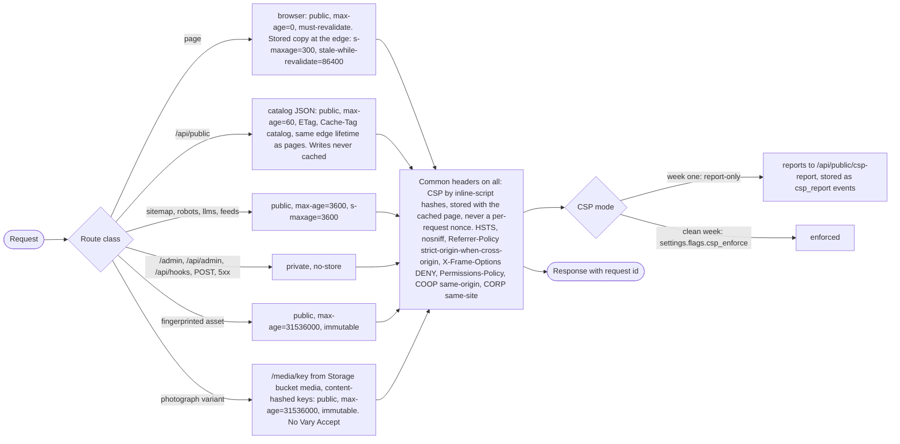
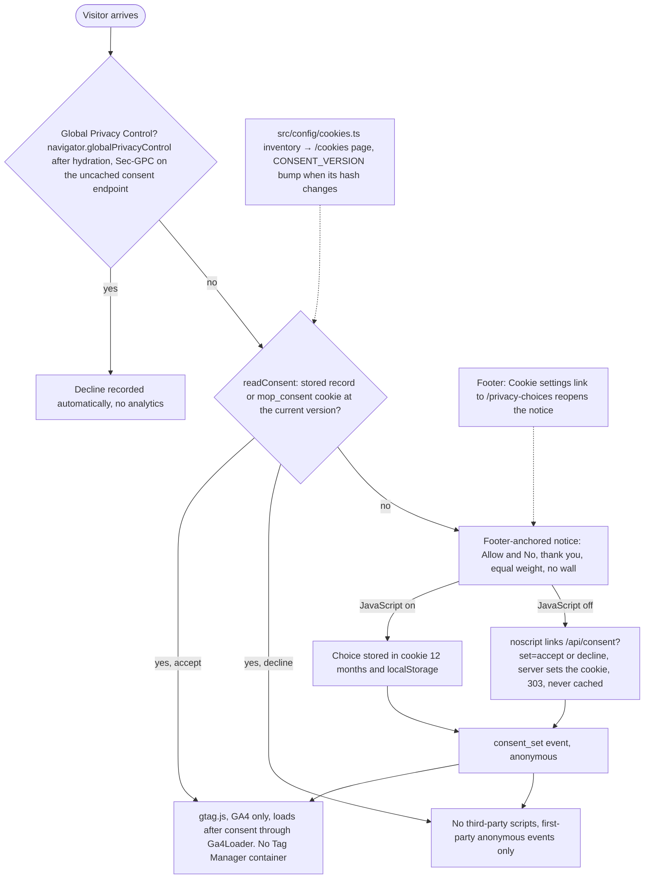
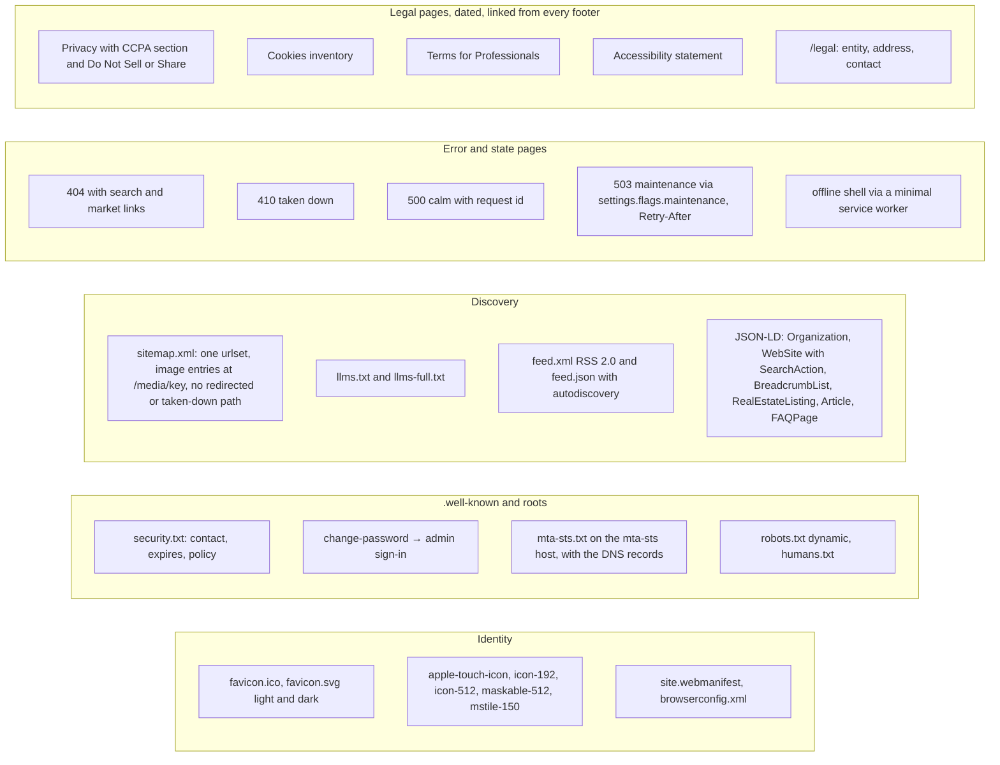

# Website essentials diagrams (plan B17)

Pictures: [img/essentials-1.png](img/essentials-1.png) every response: headers and cache class,
[img/essentials-2.png](img/essentials-2.png) consent flow, [img/essentials-3.png](img/essentials-3.png) the files every professional site serves.

## 1. Every response: headers by route class

## 2. Consent flow

## 3. The files every professional site serves

