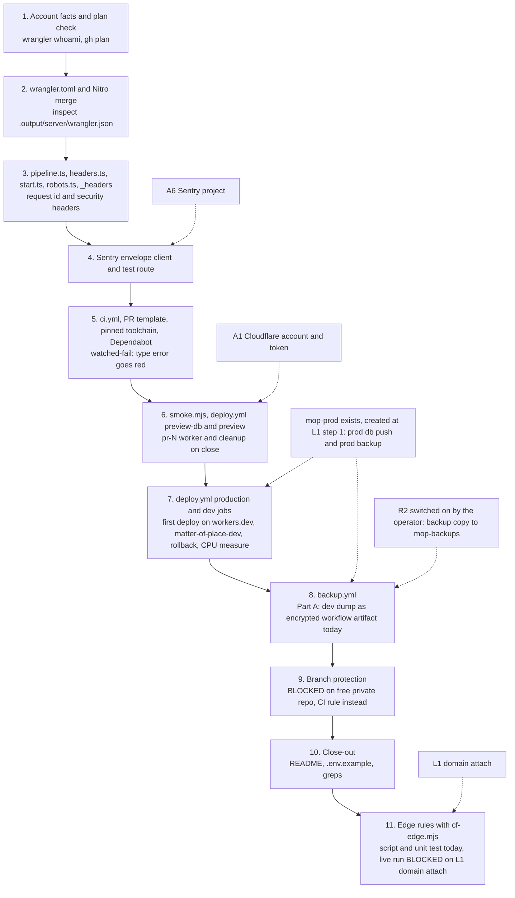
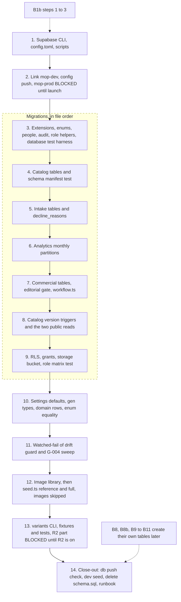
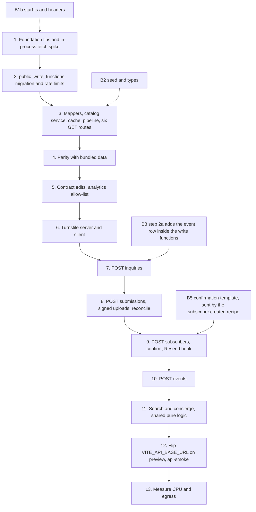
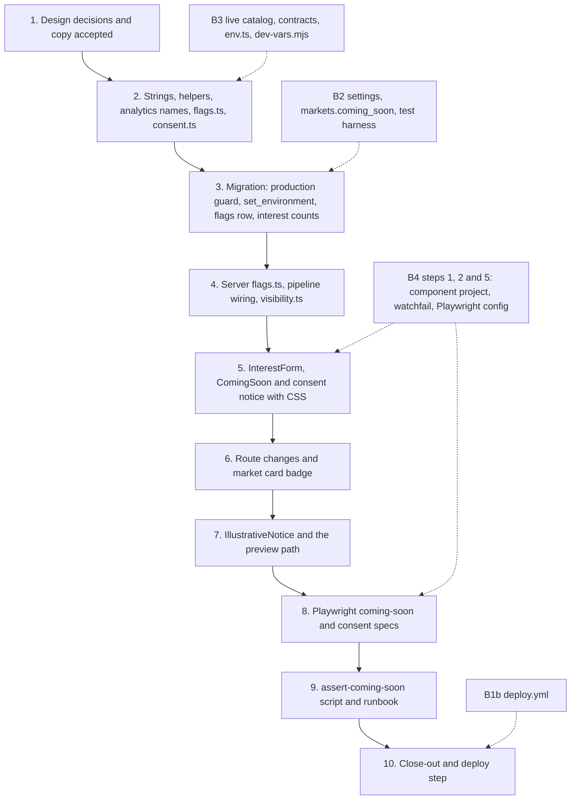
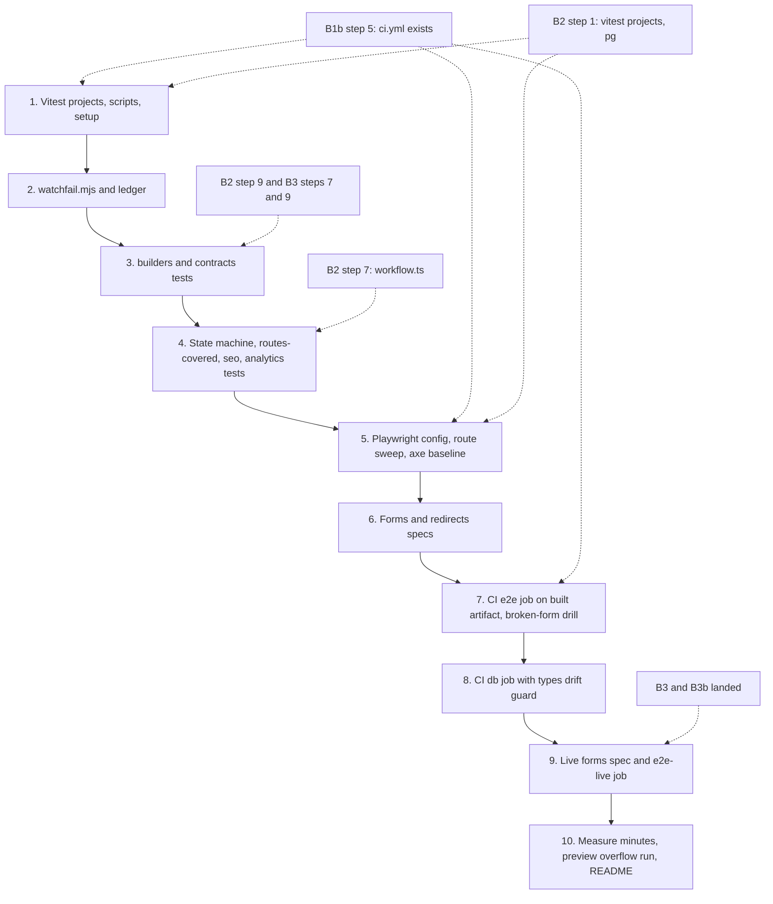
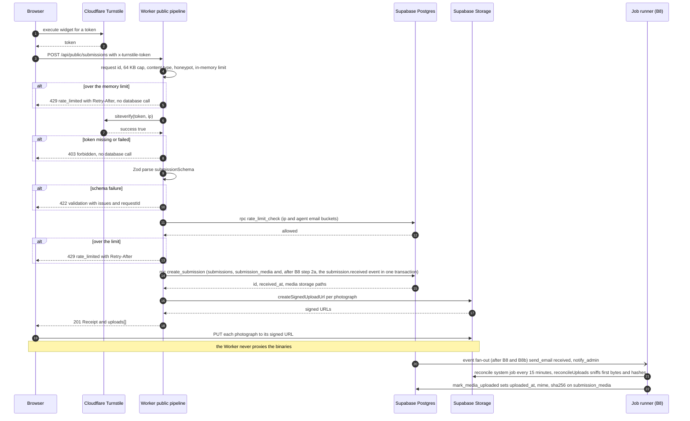

# Plans A diagrams (batch A, foundation and intake)

Words: `../05-plans/B1b.md`, `B2.md`, `B3.md`, `B3b.md`, `B4.md`. Pictures: `img/plans-a-1.png` to `-6.png`.
Diagrams 1 to 5 show step order per plan (solid arrows are the plan's own order, dashed arrows are dependencies on another plan). Diagram 6 is the public submission write path from B3.

## 1. B1b Repo and delivery, step order

## 2. B2 Database, step order

## 3. B3 API, step order

## 4. B3b Coming-soon mode, step order

## 5. B4 Tests, step order

## 6. Public submission write path (POST /api/public/submissions)

Source: B3 invariant 17 (pipeline order), steps 2, 6 and 8, and rulings G20 and G49. The memory limit, Turnstile and Zod run before any database call; the database rate limit is the first database call; the event is written by the SQL function in the same transaction as the row (once B8 step 2a re-bodies it). The photographs never pass through the Worker.

