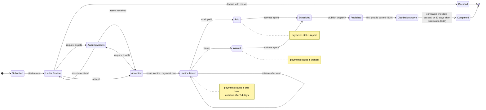
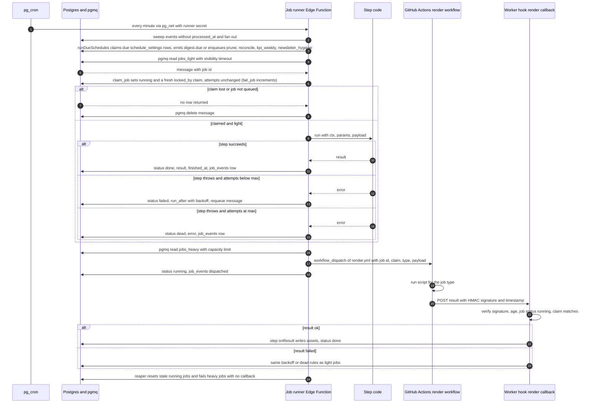
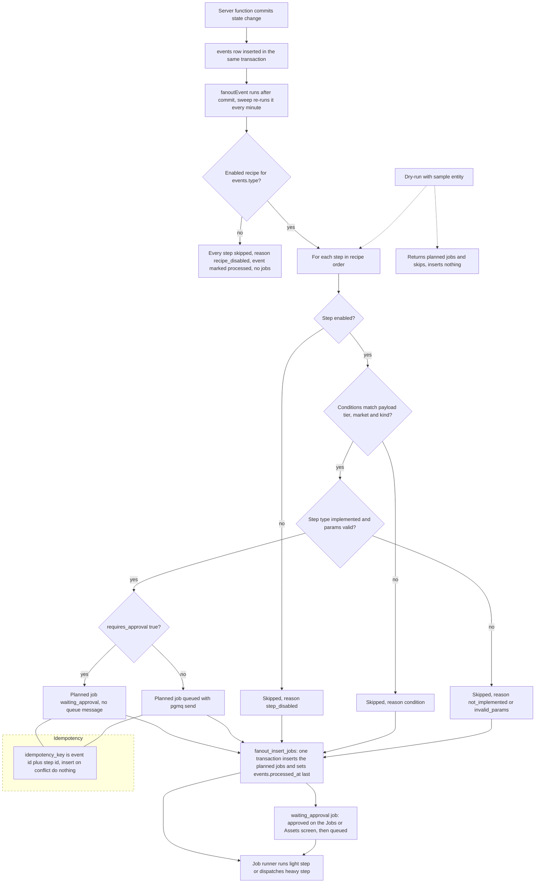

# Plans B diagrams (batch B, operate the business)

Words: `../05-plans/B5.md`, `B6.md`, `B7.md`, `B8.md`, `B8b.md`, `B16.md`. Pictures: `img/plans-b-1.png`, `-2.png`, `-3.png`.

## 1. Submission workflow with invoice states

Source of truth: `submissions.workflow_state` (architecture 3.3) and `payments.status` (3.4). The states Paid and Waived
are the invoice states shown in the path. The trigger `enforce_editorial_gate` refuses Invoice Issued and later states
without `accepted_at`, and refuses Scheduled without a payment that is paid or waived (S32, B6).

## 2. Job runner, from pop to done, failed or dead

Light jobs run inside the Edge Function. Heavy jobs are dispatched to GitHub Actions and finish through the signed
callback (B8). One transition per row in `job_events`.

## 3. Recipe engine, from event to jobs and the approval gate

Same planner runs for the real event and for the dry-run. Dry-run never inserts (B8b).

