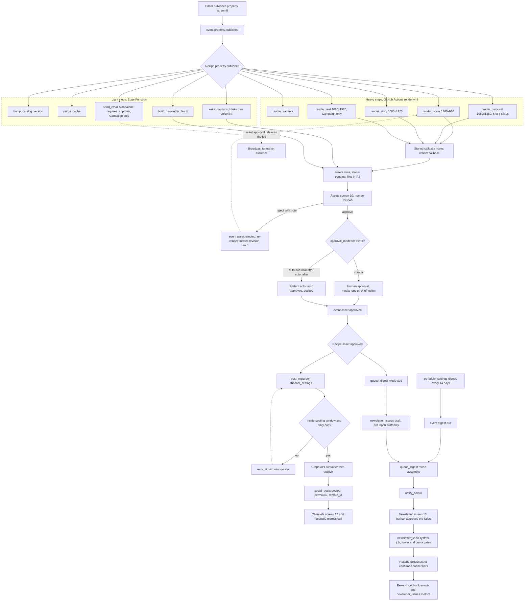
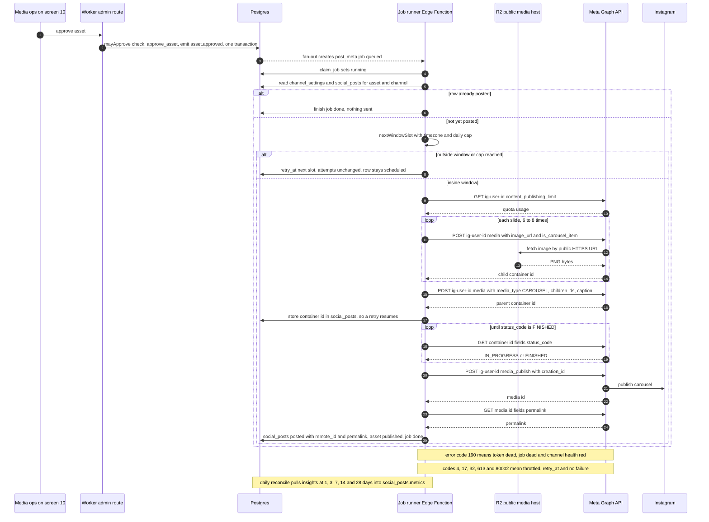
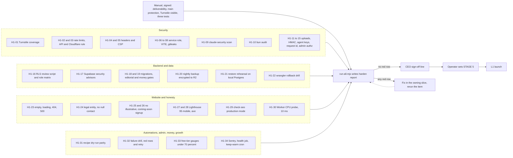

# Plans C diagrams (batch C, content, growth, hardening, launch)

Words: `../05-plans/B9.md`, `B10.md`, `B11.md`, `B12.md`, `B13.md`, `B14.md`, `B15.md`, `H1.md`, `L1.md`. Pictures: `img/plans-c-1.png`, `-2.png`, `-3.png`.

## 1. From publish to render, approval, post and digest

Exact step names come from the catalog in architecture 5. Heavy steps run in GitHub Actions and return through the signed callback,
light steps run in the Edge Function job runner. Approval is a human (S23) until the automatic path opens for Feature tier after
`auto_after`. `queue_digest` has two modes (ASSUMED, B11): `add` on `asset.approved`, `assemble` on `digest.due`.

## 2. The Meta publish call for an approved carousel

One `post_meta` job, one Instagram carousel. Facebook runs the same job with its own calls (photo post for the cover, photo story).
Every call carries `appsecret_proof`. Meta downloads the images itself from the public R2 host.

## 3. HARDEN checklist by lane

Thirty-four items in `H1.md`, run by `scripts/harden/run-all.mjs`. Two rehearsals are done for real (restore and rollback).
Green report, then the CEO signs, then the operator moves the STAGE line to 5 and L1 starts.

